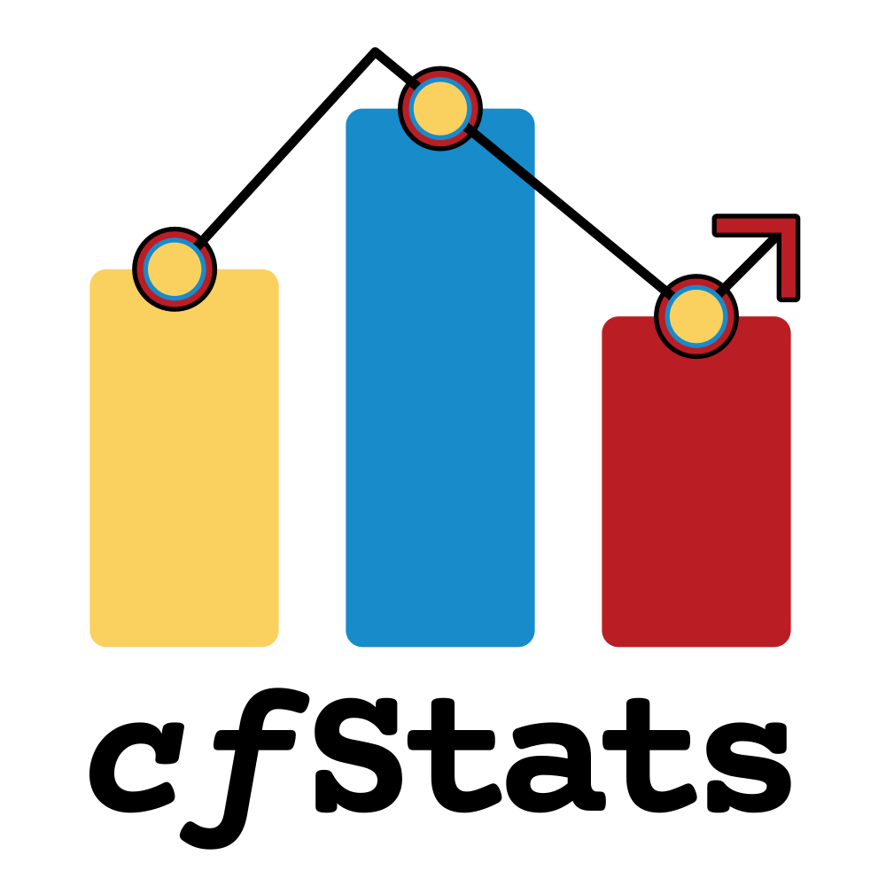
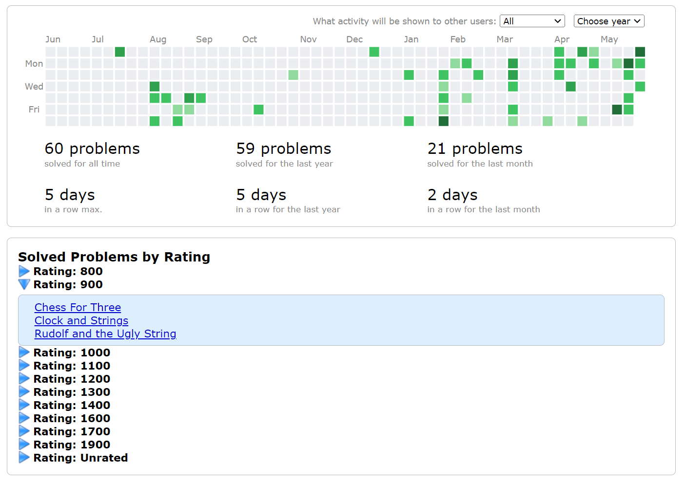
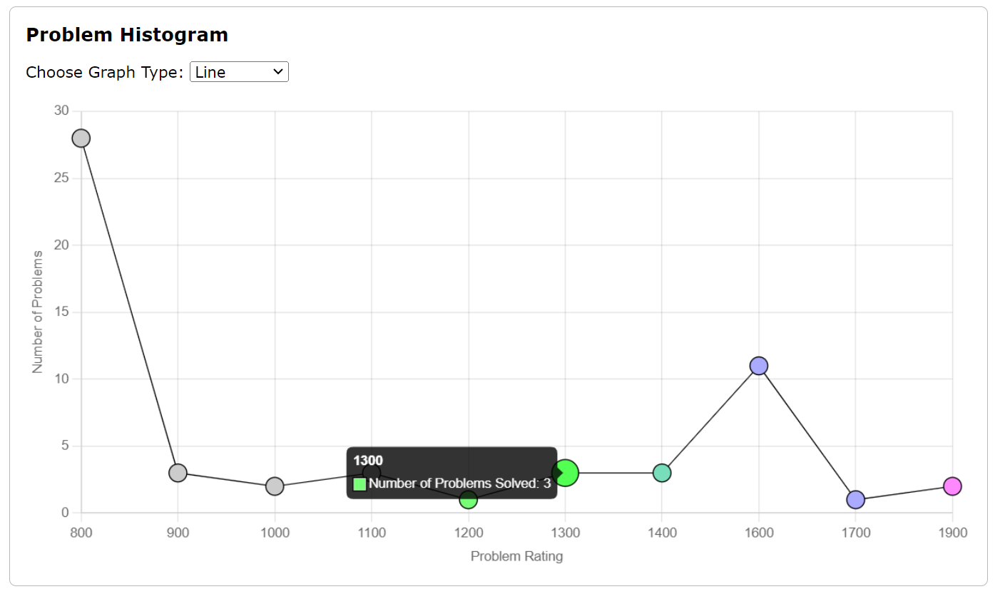
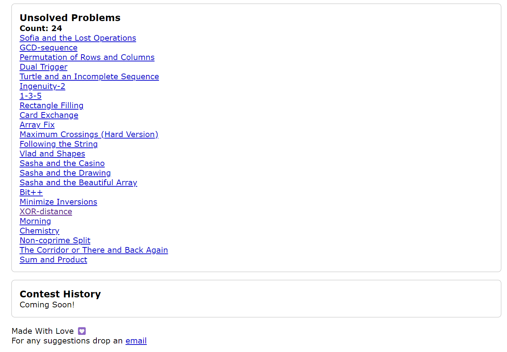

  

<h1 align="center">cfStats</h1>

  <a href="https://chrome.google.com/webstore/detail/cfstats/bchliaklmfjameoifffgkacempfljakb">Check it out on the Chrome Webstore</a>

### Features

- **Solved Problems by Rating**: Solved/Accepted problems are grouped by difficulty ratings.
- **Problem Histogram**: A graphical representation of solved problems according to difficulty ratings, powered by [chart.js](https://www.chartjs.org/).
- **Unsolved Problems**: Displays problems that have been submitted but not accepted.
- **Contest History**: Graphically represents the user's journey in contests, showing contest rank, rating gain, and expected rank for each contest.
- **Theme & Appeal**: The extension results are designed to blend with the Codeforces.com theme, ensuring it doesn’t look distracting or out of place. 😉

---

### Screenshots

