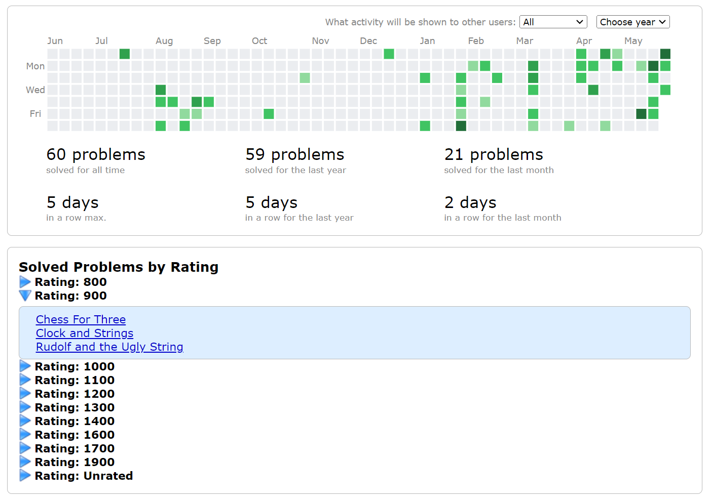

# cfStats
### Features
- **Solved Problems by Rating** : Solved/Accepted Problems are clubbed with same difficulty ratings.
- **Problem Histogram** : Graphical representation of solved problems according to difficulty ratings. Powered by [chart.js](https://www.chartjs.org/) 
- **Unsolved Problems** : Problems that have been submited but have not been accepted.
- **Contest History** : Graphical representaion of user's journery representing contest rank, rating gain and what was expected rank for user for that contest.
- **Theme & Appeal** : Have tired to merge merge the extension results with codeforces.com theme so that it doesn't look distracting and out of place.😉

---

